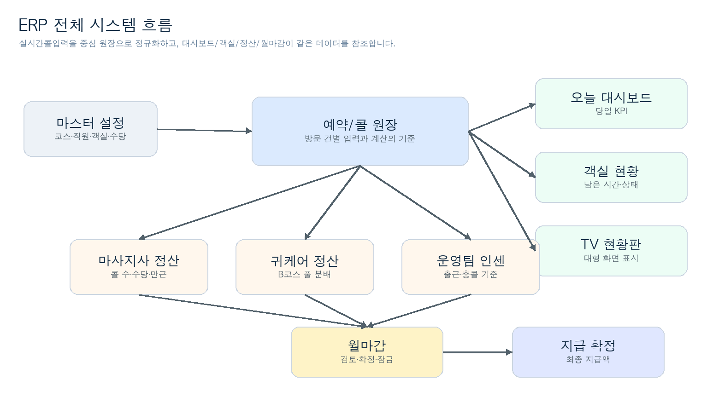
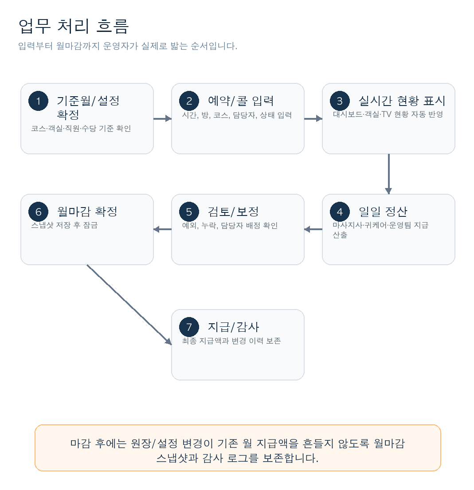
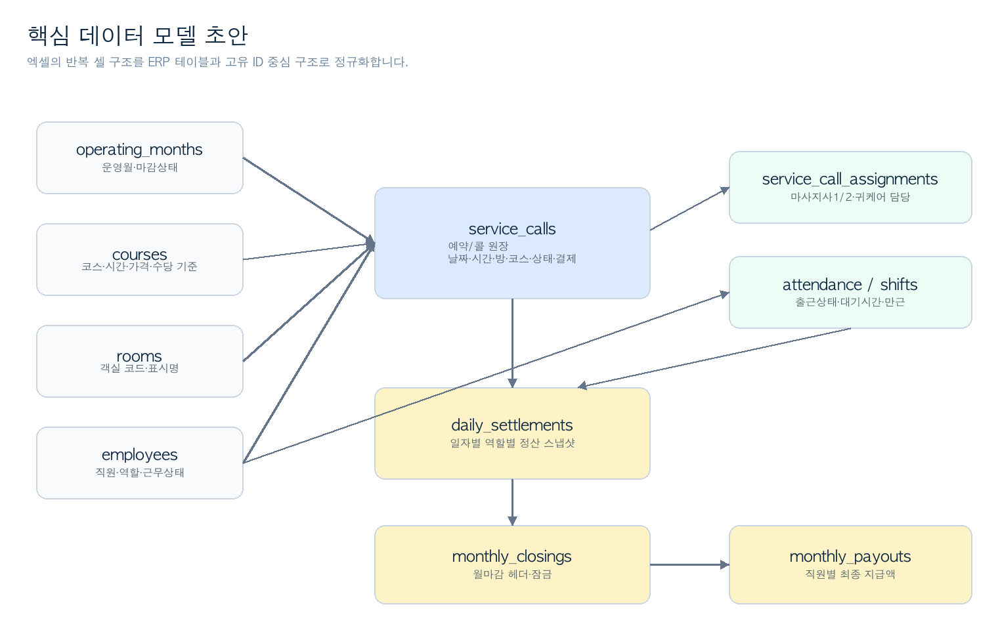

# 베트남 에스테틱 ERP 구축 상세 사양서

작성일: 2026-06-05 KST  
분석 원본: 제공된 Excel 파일 `sheet.xlsx`  
용도: 의뢰자 전달 및 신규 ERP 구축 범위 정의

## 1. 문서 목적

본 문서는 제공된 Excel 파일 `sheet.xlsx`의 모든 시트, 입력 항목, 계산 기능, 화면 구조, 정산 로직을 분석하여 신규 ERP 시스템으로 전환하기 위한 상세 구축 사양을 정리한 문서입니다.

이 문서는 단순한 엑셀 설명서가 아니라, 현재 엑셀로 운영 중인 업무를 ERP의 화면, 데이터베이스, 계산 엔진, 마감 프로세스, 이관 검증 항목으로 재구성한 기능 명세서입니다.

## 2. 분석 범위와 누락 검증 결과

### 2.1 분석 대상

| 항목 | 검증 결과 |
| --- | --- |
| 원본 파일 | `sheet.xlsx` |
| 워크시트 수 | 12개 |
| 표시 시트 | 11개 |
| 숨김 시트 | 1개, `목록` |
| 수식 셀 | 36,621개 |
| 배열 수식 셀 | 6,211개 |
| 이름 정의 | 6개 |
| 데이터 검증/드롭다운 | 표준 및 x14 확장 규칙 포함 확인 |
| 조건부서식 | `웨이터리스트`, `TV현황판` 상태 색상 규칙 확인 |
| 계산 체인 | 존재함 |
| 매크로/VBA | 없음 |
| 피벗 테이블 | 없음 |
| 차트/이미지/도형 | 없음 |
| 외부 연결 | 없음 |
| 시트 보호 | 없음 |

### 2.2 전체 시트 누락 확인

아래 12개 시트를 모두 확인했으며, 각 시트의 역할과 ERP 전환 항목을 본 문서에 반영했습니다.

| 원본 시트 | 문서 반영 위치 | 반영 내용 |
| --- | --- | --- |
| 오늘대시보드 | 6.1, 7.1 | 당일/월간 운영 KPI 대시보드 |
| 실시간콜입력 | 6.2, 7.2, 8.1 | 예약/콜 원장, 매출, 할인, 정산 기초 |
| 웨이터리스트 | 6.3, 7.3 | 객실 상태, 남은 시간, 웨이터 안내 |
| TV현황판 | 6.4, 7.4 | 카운터 TV용 객실 카드 화면 |
| 운영팀근무인센 | 6.5, 8.4 | 운영팀 출근상태, 일일/월 인센 |
| 귀케어일정산 | 6.6, 8.3 | 귀케어 B코스 풀 분배 정산 |
| 마사지사일정산 | 6.7, 8.2 | 마사지사 일별 콜 수, 정산, 만근 |
| 월마감 | 6.8, 8.5 | 월 총정산, 만근수당, 갯수왕 |
| 직원DB | 5.4, 9 | 직원 마스터 |
| TV설정 | 5.2, 5.3, 6.10 | 객실, 상태, 시간, TV 표시명 |
| 설정_코스수당 | 5.1, 5.5, 5.6, 8 | 기준월, 코스, 수당, 인센 정책 |
| 목록 | 5.7, 10 | 숨김 드롭다운 보조 목록 |

### 2.3 재검증 결론

현재 원본 엑셀의 업무상 핵심 기능은 빠짐없이 다음 범주에 포함됩니다.

- 기준월 및 월별 날짜 자동 생성
- 코스/가격/시간/수당 정책
- 객실/시간/예약상태/결제수단/할인구분 드롭다운
- 예약 및 실시간 콜 입력
- 방문완료 기준 매출과 수당 자동 계산
- 일자별 지출 입력
- 객실별 실시간 상태판
- 카운터 TV 표시판
- 운영팀 출근상태 및 인센 계산
- 귀케어 일일 정산
- 마사지사 일일 정산
- 월마감 및 최종 지급액 계산
- 숨김 행/열, 접힘 블록, 조건부서식 기반 화면 표현

## 3. ERP 구축 목표

신규 ERP는 현재 엑셀 파일을 그대로 복제하는 것이 아니라, 엑셀 안에 들어 있는 업무 규칙을 데이터베이스 기반 웹 시스템으로 전환하는 것을 목표로 합니다.

### 3.1 핵심 목표

| 목표 | 설명 |
| --- | --- |
| 실시간 운영 입력 | 예약, 방문, 사용중, 청소중, 방문완료, 노쇼, 취소를 실시간으로 입력 |
| 객실 상태 관리 | 객실별 현재 상태, 남은 시간, 담당자, 종료확인 상태 표시 |
| 자동 정산 | 방문완료 기준으로 마사지사 수당, 귀케어 풀, 운영팀 인센 자동 계산 |
| 월마감 | 월별 최종 지급액 확정, 마감 후 데이터 잠금 |
| 설정 관리 | 코스, 가격, 직원, 수당, 인센 기준을 관리자 화면에서 관리 |
| 감사 가능성 | 수정 이력, 마감 이력, 지급 산출 근거를 추적 가능하게 유지 |

### 3.2 ERP 전환 방식

엑셀의 셀 좌표와 반복 행을 그대로 구현하지 않고 다음과 같이 정규화합니다.

| 엑셀 구조 | ERP 구조 |
| --- | --- |
| 월 31일 x 일 100 슬롯 | `service_calls` 예약/콜 원장 |
| 숨김 행/접힘 블록 | 날짜 필터, 일자별 상세 그리드, 아코디언 UI |
| 이름 문자열 참조 | 직원/객실/코스 고유 ID 참조 |
| 수식 계산 | 서버 계산 엔진 또는 DB 집계 |
| 월마감 수식 | 월마감 스냅샷 및 확정 프로세스 |
| 드롭다운 목록 | 관리자 설정 코드 테이블 |

## 4. 전체 시스템 구성

### 4.1 시각화 자료

아래 시각화 자료는 엑셀 기능을 ERP 화면, 데이터, 정산 프로세스로 전환할 때 의뢰자와 개발사가 같은 구조를 기준으로 범위를 확인하기 위한 자료입니다.

**그림 1. ERP 전체 시스템 흐름**



**그림 2. 업무 처리 흐름**



**그림 3. 핵심 데이터 모델 초안**



### 4.2 주요 모듈

| 모듈 | 설명 |
| --- | --- |
| 대시보드 | 당일 예약, 방문완료, 노쇼, 취소, 매출, 정산 요약 |
| 예약/콜 관리 | 고객 방문 건별 입력, 상태 변경, 담당자 배정 |
| 객실 현황 | 객실별 최신 상태와 남은 시간 계산 |
| TV 현황판 | 카운터 대형 화면용 상태 표시 |
| 마사지사 정산 | 마사지사별 출퇴근, 콜 수, 당일정산, 만근 계산 |
| 귀케어 정산 | B코스 귀케어 풀을 정상 근무자에게 분배 |
| 운영팀 인센 | 팀장/카운터/웨이터 출근상태와 인센 계산 |
| 월마감 | 월별 지급액 산출, 검토, 확정, 잠금 |
| 설정 관리 | 직원, 객실, 코스, 수당, 인센 기준, 코드 관리 |

## 5. 마스터 데이터 사양

### 5.1 기준월

원본 위치: `설정_코스수당!K2`  
현재 값: `2026-06-01`

기준월은 모든 월별 날짜 생성과 집계의 기준입니다. ERP에서는 `운영월`을 독립 엔티티로 관리해야 하며, 월마감 상태와 연결되어야 합니다.

| 필드 | 설명 |
| --- | --- |
| 운영월 | `YYYY-MM` |
| 월 시작일 | 해당 월 1일 |
| 월 종료일 | 해당 월 마지막 일 |
| 상태 | 작성중, 검토중, 마감확정, 잠금 |
| 마감일시 | 월마감 확정 시각 |
| 마감자 | 확정 처리한 사용자 |

### 5.2 객실 마스터

원본 위치: `TV설정!A4:A14`

| 객실 |
| --- |
| 101 호실 |
| 102 호실 |
| 103 호실 |
| 201 호실 |
| 202 호실 |
| 203 호실 |
| 301 호실 |
| 302 호실 |
| 303 호실 |
| 401 호실 |
| 402 호실 |

ERP 요구사항:

- 객실은 고유 ID와 표시명을 분리합니다.
- 객실 사용 여부를 관리할 수 있어야 합니다.
- 객실 삭제 대신 비활성 처리 방식을 권장합니다.

### 5.3 상태, 시간, 결제, 할인 코드

| 코드 분류 | 값 | 원본 |
| --- | --- | --- |
| 예약/콜 상태 | 예약, 사용중, 청소중, 방문완료, 노쇼, 취소 | `TV설정!B4:B9` |
| 결제수단 | 현금, 카드, 계좌, 기타 | `실시간콜입력!Q14:Q3204` |
| 할인구분 | 일주일내방문, 생일자, 후기작성 | `실시간콜입력!P14:P3204` |
| 확인값 | Y, N 등 | `목록!G2:G51` |
| 운영팀/귀케어 근무상태 | 정상, 휴무, 지각, 조퇴, 결근 | 근무/정산 시트 |

시간 목록 관련 주의사항:

- `실시간콜입력`의 시간 드롭다운 원천은 `TV설정!C4:C32`이며 11:00부터 01:00까지 30분 단위 총 29개입니다.
- 이름 정의 `시간목록`은 `설정_코스수당!K5:K35`이며 11:00부터 02:00까지 총 31개입니다.
- ERP에서는 중복 시간 목록을 하나의 시간 슬롯 마스터로 통합하고, 01:30 및 02:00 사용 여부를 의뢰자에게 최종 확인해야 합니다.

### 5.4 직원 마스터

원본 위치: `직원DB`

| 구분 | 인원 | 설명 |
| --- | --- | --- |
| 운영팀 | 5명 | 팀장 1명, 카운터 2명, 웨이터 2명 |
| 귀케어팀 | 4명 | 귀케어1~귀케어4 |
| 마사지사 | 50명 | 마사지사1~마사지사50 |

대표 급여/상태:

| 이름 | 직책 | 주/야간 | 기본급 | 상태 |
| --- | --- | --- | --- | --- |
| 팀장 | 팀장 | 전체 | 22,000,000 | 재직 |
| 카운터1 | 카운터 | 주간 | 12,000,000 | 재직 |
| 카운터2 | 카운터 | 야간 | 12,000,000 | 재직 |
| 웨이터1 | 웨이터 | 주간 | 9,000,000 | 재직 |
| 웨이터2 | 웨이터 | 야간 | 9,000,000 | 재직 |
| 귀케어1~4 | 귀케어사 | 미입력 | 5,000,000 | 재직 |
| 마사지사1~50 | 마사지사 | 미입력 | 0 | 재직 |

ERP 요구사항:

- 직원명은 변경될 수 있으므로 이름을 키로 사용하지 않습니다.
- 직원 ID, 역할, 근무상태, 재직상태를 분리합니다.
- 과거 정산 내역은 당시 이름과 당시 수당 기준을 스냅샷으로 보존해야 합니다.

### 5.5 코스 마스터

원본 위치: `설정_코스수당!A6:H10`

| 코드 | 코스명 | 시간 | 기본판매가 | 운영팀 콜인정 | 귀케어 풀/콜 | 마사지사2 필요 | 메모 |
| --- | --- | --- | --- | --- | --- | --- | --- |
| A | 60분 A코스 누루마사지 | 60분 | 1,500,000 | 1 | 0 | N |  |
| B | 90분 B코스 귀청소+마사지 | 90분 | 1,800,000 | 1 | 100,000 | N | 귀케어 수당은 일별 N분의1 |
| C | 90분 C코스 때밀이+마사지 | 90분 | 2,000,000 | 1 | 0 | N |  |
| D | 90분 D코스 2:1 코스 | 90분 | 3,200,000 | 1 | 0 | Y | 마사지사 2명 가능 |
| E | 120분 E코스 풀코스 패키지 | 120분 | 3,000,000 | 1 | 100,000 | N | 귀케어 포함 |

TV 표시명:

| 코드 | TV 표시명 |
| --- | --- |
| A | A 누루60 |
| B | B 귀청소90 |
| C | C 때밀이90 |
| D | D 2:1 90 |
| E | E 풀코스120 |

### 5.6 마사지사 개인별 코스 수당

원본 위치: `설정_코스수당!A15:F64`

현재 수당표 구조:

- 마사지사 50명 기준입니다.
- `마사지사1`~`마사지사4`는 A/B/C 수당이 입력되어 있습니다.
- `마사지사5`~`마사지사50`은 A~E 수당이 0으로 초기화되어 있습니다.

대표 값:

| 마사지사 | A수당 | B수당 | C수당 | D수당 | E수당 |
| --- | --- | --- | --- | --- | --- |
| 마사지사1 | 700,000 | 900,000 | 900,000 | 0 | 0 |
| 마사지사2 | 700,000 | 900,000 | 900,000 | 0 | 0 |
| 마사지사3 | 700,000 | 900,000 | 900,000 | 0 | 0 |
| 마사지사4 | 700,000 | 900,000 | 900,000 | 0 | 0 |
| 마사지사5~50 | 0 | 0 | 0 | 0 | 0 |

ERP 요구사항:

- 개인별 수당은 코스별로 저장합니다.
- 적용 시작월과 종료월을 가져야 합니다.
- 월마감 확정 후 과거 수당표 변경이 지급액을 바꾸면 안 됩니다.

### 5.7 숨김 보조 목록

원본 시트: `목록`  
표시 상태: 숨김

숨김 목록은 날짜, 시간, 방번호, 코스, 예약상태, 결제수단, 확인값, 마사지사, 귀케어 드롭다운 원천으로 사용됩니다.

주의사항:

- `목록`의 방번호는 `1번방`, `2번방` 형식입니다.
- 운영 화면의 객실은 `101 호실`, `102 호실` 형식입니다.
- ERP에서는 객실 ID를 하나로 통합하고 화면별 표시명만 분리해야 합니다.

## 6. 화면별 상세 기능 사양

### 6.1 오늘 대시보드

원본 시트: `오늘대시보드`

목적:

- 특정 조회일 기준 당일 상태와 월간 상태를 한 화면에서 확인합니다.

입력:

| 항목 | 설명 |
| --- | --- |
| 조회날짜 | `B3`, 날짜 드롭다운 |

표시 항목:

| 영역 | 표시 항목 |
| --- | --- |
| 오늘 상태 요약 | 오늘 예약건수, 오늘 방문완료 콜, 오늘 노쇼, 오늘 취소, 오늘 결제합계, 오늘 마사지사 담당콜, 오늘 마사지사 정산 |
| 방문완료 코스별 | A~E 코스별 방문완료 건수 |
| 월간 상태 요약 | 월 방문완료 콜, 월 예약건수, 월 노쇼, 월 취소, 월 방문완료 매출 |

ERP 사양:

- 날짜 선택 시 실시간 집계 API를 호출합니다.
- 원천 데이터는 `service_calls`와 정산 집계 테이블입니다.
- 매출과 정산 금액은 방문완료 상태만 집계합니다.

### 6.2 예약/콜 입력 화면

원본 시트: `실시간콜입력`

목적:

- 예약, 입실, 사용중, 청소중, 방문완료, 노쇼, 취소를 건별로 입력합니다.
- 방문완료 처리 시 매출과 수당을 자동 계산합니다.

원본 구조:

| 항목 | 값 |
| --- | --- |
| 사용범위 | `A1:AA3204` |
| 고정창 | `A12` |
| 일자 블록 | 31개 |
| 일별 입력 슬롯 | 100개 |
| 총 입력 슬롯 | 3,100개 |
| 숨김 열 | K, L |
| 숨김 행 | 3,060행 |

반복 구조:

```text
블록시작행 = 12 + 103 x (일자 - 1)
헤더행 = 블록시작행 + 1
입력행 = 블록시작행 + 2 ~ 블록시작행 + 101
일일 입력 끝 = 블록시작행 + 102
```

입력 및 계산 필드:

| 원본 컬럼 | 항목 | ERP 필드 | 성격 | 설명 |
| --- | --- | --- | --- | --- |
| A | 번호 | slot_no | 표시 | 일자별 1~100 슬롯 |
| B | 날짜 | service_date | 자동 | 기준월과 일자 블록 기준 |
| C | 시간 | start_time | 입력 | 시작 시간 |
| D | 방번호 | room_id | 입력 | 객실 선택 |
| E | 코스 | course_id | 입력 | A~E 코스 |
| F | 고객/메모 | customer_memo | 입력 | 고객명 또는 운영 메모 |
| G | 마사지사1 | therapist_1_id | 입력 | 주 담당 마사지사 |
| H | 마사지사2 | therapist_2_id | 입력 | 보조 또는 2인 코스 담당 |
| I | 귀케어담당 | earcare_staff_id | 입력 | 귀케어 담당자 |
| J | 결제금액 | payment_amount | 자동 | 방문완료 시 계산 |
| K | 마사지사1수당 | therapist_1_commission | 자동 | 숨김 계산 열 |
| L | 마사지사2수당 | therapist_2_commission | 자동 | 숨김 계산 열 |
| M | 귀케어풀 | earcare_pool_amount | 자동 | 코스별 귀케어 풀 |
| N | 콜인정 | recognized_call_count | 자동 | 방문완료면 1 |
| O | 예약상태 | status | 입력 | 예약, 사용중, 청소중, 방문완료, 노쇼, 취소 |
| P | 할인구분 | discount_type | 입력 | 할인 사유 |
| Q | 결제수단 | payment_method | 입력 | 현금, 카드, 계좌, 기타 |
| R | 비고 | note | 입력 | 추가 메모 |
| S | 확인 | confirmed_flag | 입력 | 확인값 |

일별 사이드 영역:

| 원본 열 | 기능 |
| --- | --- |
| U:V | 일자별 예약건수, 방문완료, 노쇼/취소, 결제합계, 마사지사정산, 귀케어풀, 할인합계, 지출합계, 순매출 |
| W:X | A~E 코스별 방문완료, 할인건수, 마사지사담당 수 |
| U:X 하단 | 일별 지출금액, 내용, 담당자, 비고 입력 |

ERP 요구사항:

- 일자별 슬롯 방식 또는 리스트 방식 중 하나로 구현할 수 있습니다.
- 상태 변경 이력은 저장해야 합니다.
- 방문완료 상태가 아닌 건은 매출과 정산에 포함하지 않습니다.
- D코스처럼 마사지사2 필요 코스는 ERP에서 필수 입력 검증을 추가해야 합니다.
- 할인구분이 있으면 현재 엑셀은 일괄 100,000 할인으로 계산합니다.

### 6.3 웨이터 객실 현황 화면

원본 시트: `웨이터리스트`

목적:

- 웨이터가 객실별 현재 상태와 안내 문구를 빠르게 확인합니다.

표시 객실:

- 101, 102, 103
- 201, 202, 203
- 301, 302, 303
- 401, 402

표시 항목:

| 항목 | 설명 |
| --- | --- |
| 방번호 | 객실 표시명 |
| 상태 | 사용중, 예약, 청소중, 종료확인, 빈방 |
| 코스 | 현재 또는 예약 코스 |
| 담당 | 담당 마사지사 |
| 시작 | 시작 시간 |
| 남은분 | 종료까지 남은 분 |
| 종료예정 | 예상 종료 시간 |
| 웨이터 안내 | 입실 가능, 청소 진행, 예약 대기, 종료 확인 등 |
| 메모 | 운영 메모 |

계산 규칙:

- 객실별 최신 `사용중`, `청소중`, `예약` 건을 찾습니다.
- `사용중`이고 남은 시간이 0이면 `종료확인`으로 표시합니다.
- 시작시간이 새벽 3시 이전일 경우 자정 초과를 보정합니다.

ERP 요구사항:

- 객실 상태 조회 API가 필요합니다.
- 상태별 색상과 안내 문구는 코드화합니다.
- 운영자가 수동으로 청소중/빈방 전환할 수 있는 기능이 필요할 수 있습니다.

### 6.4 TV 현황판

원본 시트: `TV현황판`

목적:

- 카운터 또는 매장 TV에서 객실 상태를 대형 카드로 표시합니다.

주요 기능:

- 11개 객실 카드 표시
- 사용중, 예약, 청소중, 종료확인, 빈방 상태별 색상 표시
- 남은 시간, 코스, 담당자 표시
- `웨이터리스트` 결과를 그대로 참조

ERP 요구사항:

- 전체화면 표시 모드가 필요합니다.
- 자동 새로고침 또는 실시간 웹소켓 갱신을 권장합니다.
- TV 화면은 입력 기능 없이 조회 전용으로 구현합니다.

### 6.5 운영팀 근무 및 인센 화면

원본 시트: `운영팀근무인센`

목적:

- 운영팀 5명의 출근상태와 일일/월 인센을 계산합니다.

대상자:

- 팀장
- 카운터1
- 카운터2
- 웨이터1
- 웨이터2

일일 입력:

| 항목 | 설명 |
| --- | --- |
| 날짜 | 기준월의 1~31일 |
| 총콜 | 해당일 방문완료 콜 수 |
| 일일개인인센 | 총콜 구간별 개인 지급액 |
| 각 직원 상태 | 정상, 휴무, 지각, 조퇴, 결근 |
| 각 직원 인센 | 정상인 경우만 지급 |

일일 인센 기준:

| 일 총콜 이상 | 개인별 지급액 |
| --- | --- |
| 30 | 50,000 |
| 40 | 100,000 |
| 50 | 200,000 |

월 인센 기준:

| 월 총콜 이상 | 전체 월인센 | 팀장 | 카운터팀 | 웨이터팀 |
| --- | --- | --- | --- | --- |
| 1,000 | 3,000,000 | 30% | 35% | 35% |
| 1,100 | 5,000,000 | 30% | 35% | 35% |
| 1,200 | 8,000,000 | 30% | 35% | 35% |
| 1,300 | 12,000,000 | 30% | 35% | 35% |
| 1,400 | 18,000,000 | 30% | 35% | 35% |
| 1,500 | 25,000,000 | 30% | 35% | 35% |

ERP 요구사항:

- 출근상태는 일별로 저장합니다.
- 정상 상태만 인센 지급 대상입니다.
- 월 인센은 팀장, 카운터팀, 웨이터팀으로 분배합니다.

### 6.6 귀케어 일일정산 화면

원본 시트: `귀케어일정산`

목적:

- B코스 방문완료 기준으로 발생한 귀케어 풀을 정상 근무 귀케어사에게 균등 배분합니다.

구조:

| 항목 | 값 |
| --- | --- |
| 사용범위 | `A1:J220` |
| 일자 블록 | 31개 |
| 일별 상세 인원 | 귀케어1~귀케어4 |
| 숨김 행 | 186행 |

필드:

| 항목 | 설명 |
| --- | --- |
| 날짜 | 기준월 일자 |
| 귀케어사 | 귀케어1~귀케어4 |
| 근무상태 | 정상, 휴무, 지각, 조퇴, 결근 |
| 당일 B콜 | 해당일 B코스 방문완료 수 |
| 당일 귀케어풀 | 해당일 귀케어 풀 합계 |
| 정상근무자수 | 해당일 정상 귀케어사 수 |
| 1인 지급액 | 정상근무자에게 균등 배분한 금액 |
| 메모 | 추가 기록 |

ERP 요구사항:

- 귀케어 근무상태 입력 화면이 필요합니다.
- 귀케어 지급액은 일자별 계산 후 월마감에 반영합니다.
- 정상근무자수가 0명인 경우 처리 정책을 정의해야 합니다.

### 6.7 마사지사 일일정산 화면

원본 시트: `마사지사일정산`

목적:

- 마사지사별 출퇴근, 대기시간, 코스별 담당 콜, 당일 정산액, 만근 인정 여부를 계산합니다.

구조:

| 항목 | 값 |
| --- | --- |
| 사용범위 | `A1:N1616` |
| 일자 블록 | 31개 |
| 일별 상세 인원 | 마사지사 50명 |
| 숨김 행 | 1,581행 |

필드:

| 항목 | 설명 |
| --- | --- |
| 날짜 | 기준월 일자 |
| 마사지사 | 마사지사1~마사지사50 |
| 출근시간 | 수동 입력 |
| 퇴근시간 | 수동 입력 |
| 대기시간 | 출근/퇴근 기준 자동 계산 |
| A~E콜 | 코스별 담당 방문완료 수 |
| 총콜 | A~E콜 합계 |
| 당일정산 | 해당 마사지사의 수당 합계 |
| 만근인정 | 대기시간 8시간 이상이면 인정 |

계산 규칙:

- 마사지사가 `마사지사1` 또는 `마사지사2` 어느 칸에 있든 담당 콜로 인정합니다.
- 당일정산은 `실시간콜입력`의 마사지사1수당, 마사지사2수당을 합산합니다.
- 퇴근시간이 출근시간보다 빠르면 자정 이후 퇴근으로 보고 1일을 더해 계산합니다.

ERP 요구사항:

- 마사지사 출퇴근 입력과 콜 배정은 분리된 데이터로 저장합니다.
- 당일정산은 콜 원장과 개인별 수당표 기준으로 재계산 가능해야 합니다.
- 월마감 확정 후에는 해당 월 정산 결과를 잠가야 합니다.

### 6.8 월마감 화면

원본 시트: `월마감`

목적:

- 마사지사, 운영팀, 귀케어의 월 지급액을 확인하고 최종 마감합니다.

마사지사 월마감:

| 항목 | 설명 |
| --- | --- |
| 월 총콜 | 마사지사 일일정산의 총콜 합산 |
| 월 정산액 | 마사지사 일일정산의 당일정산 합산 |
| 만근 인정일 | 만근인정 일수 |
| 만근수당 | 20일 이상이면 2,000,000 |
| 갯수왕순위 | 월 총콜 40콜 이상 대상 순위 |
| 갯수왕수당 | 1위 5,000,000, 2위 3,000,000, 3위 1,000,000 |
| 최종지급액 | 월 정산액 + 만근수당 + 갯수왕수당 |

운영팀/귀케어 월마감:

| 항목 | 설명 |
| --- | --- |
| 운영팀 월 총콜 | 운영팀근무인센 월 총콜 |
| 운영팀 월인센 전체 | 운영팀 월 인센 기준에 따른 금액 |
| 운영팀 일일인센 합계 | 팀장, 카운터, 웨이터 일일 인센 합계 |
| 귀케어 지급 합계 | 귀케어일정산 지급액 합계 |
| 마사지사 최종 지급 합계 | 마사지사 50명 최종지급액 합계 |

ERP 요구사항:

- 월마감은 계산 미리보기, 검토, 확정, 잠금 단계가 필요합니다.
- 확정 후 원장 수정이 필요하면 권한 있는 사용자의 재오픈 절차가 필요합니다.
- 마감 결과는 스냅샷으로 저장합니다.

### 6.9 직원 관리 화면

원본 시트: `직원DB`

필수 기능:

- 직원 등록, 수정, 비활성 처리
- 역할 관리: 운영팀, 귀케어팀, 마사지사
- 주/야간, 기본급, 연락처, 생일, 입사일, 재직상태 관리
- 이름 변경 이력 관리

### 6.10 설정 관리 화면

원본 시트: `TV설정`, `설정_코스수당`, `목록`

필수 기능:

- 기준월 관리
- 코스 및 가격 관리
- 개인별 마사지사 수당 관리
- 운영팀 일일/월 인센 기준 관리
- 객실 목록 관리
- 시간 슬롯 관리
- 상태/결제/할인 코드 관리

## 7. 데이터베이스 설계 초안

| 테이블 | 주요 필드 | 설명 |
| --- | --- | --- |
| operating_months | id, year_month, start_date, end_date, status, closed_at, closed_by | 운영월 및 마감 상태 |
| rooms | id, code, display_name, active | 객실 마스터 |
| employees | id, name, role, shift_type, base_salary, phone, birthday, hire_date, employment_status | 직원 공통 마스터 |
| courses | id, code, name, duration_minutes, base_price, ops_call_credit, earcare_pool_amount, requires_second_therapist, active | 코스 마스터 |
| course_display_names | course_id, display_name | TV 표시명 |
| therapist_course_rates | therapist_id, course_id, amount, effective_from_month, effective_to_month | 마사지사 개인별 코스 수당 |
| code_items | group_key, code, label, sort_order, active | 상태, 결제수단, 할인구분 등 코드 |
| service_calls | id, service_date, start_time, room_id, course_id, customer_memo, status, discount_type, payment_method, note, confirmed_flag | 예약/콜 원장 |
| service_call_assignments | service_call_id, employee_id, assignment_role, commission_amount | 마사지사1, 마사지사2, 귀케어 담당 |
| daily_expenses | id, expense_date, amount, description, employee_id, note | 일별 지출 |
| ops_attendance | work_date, employee_id, work_status | 운영팀 근무상태 |
| earcare_attendance | work_date, employee_id, work_status | 귀케어 근무상태 |
| therapist_shifts | work_date, therapist_id, clock_in, clock_out, standby_hours, full_attendance_flag | 마사지사 출퇴근 및 만근 |
| daily_settlements | work_date, employee_id, role, call_count, settlement_amount, details_json | 일일 정산 결과 |
| monthly_closings | id, year_month, status, total_sales, total_expenses, total_payout, closed_at, closed_by | 월마감 헤더 |
| monthly_payouts | closing_id, employee_id, base_settlement, daily_incentive, monthly_incentive, attendance_bonus, ranking_bonus, final_amount | 월별 지급액 |
| audit_logs | actor_id, action, target_type, target_id, before_json, after_json, created_at | 감사 로그 |

## 8. 계산 로직 상세

### 8.1 예약/콜 매출 및 수당 계산

```text
if 상태 != 방문완료:
  결제금액 = 0
  마사지사1수당 = 0
  마사지사2수당 = 0
  귀케어풀 = 0
  콜인정 = 0

if 상태 == 방문완료:
  할인금액 = 할인구분이 비어 있으면 0, 값이 있으면 100000
  결제금액 = max(0, 코스 기본판매가 - 할인금액)
  마사지사1수당 = 개인별 코스 수당표[마사지사1, 코스]
  마사지사2수당 = 마사지사2가 있으면 개인별 코스 수당표[마사지사2, 코스], 없으면 0
  귀케어풀 = 코스별 귀케어 풀/콜
  콜인정 = 1
```

### 8.2 마사지사 일일 정산

```text
코스별 콜 수 = 방문완료 건 중 마사지사가 마사지사1 또는 마사지사2로 배정된 건수
총콜 = A콜 + B콜 + C콜 + D콜 + E콜
당일정산 = 해당 마사지사에게 배정된 수당 합계
대기시간 = 퇴근시간 >= 출근시간 ? 퇴근시간 - 출근시간 : 퇴근시간 + 24시간 - 출근시간
만근인정 = 대기시간 >= 8시간
```

### 8.3 귀케어 일일 정산

```text
당일 B콜 = 해당일 B코스 방문완료 수
당일 귀케어풀 = 해당일 방문완료 건의 귀케어풀 합계
정상근무자수 = 해당일 귀케어 근무상태가 정상인 인원 수
1인 지급액 = 정상근무자수 > 0 ? 당일 귀케어풀 / 정상근무자수 : 0
개인지급액 = 근무상태 == 정상 ? 1인 지급액 : 0
```

### 8.4 운영팀 인센

```text
일일 총콜 = 해당일 방문완료 콜 수
일일 개인인센:
  50콜 이상 = 200000
  40콜 이상 = 100000
  30콜 이상 = 50000
  그 외 = 0

직원별 일일인센 = 근무상태가 정상인 경우만 일일 개인인센 지급

월 총콜 기준 월인센:
  1000콜 이상 = 3000000
  1100콜 이상 = 5000000
  1200콜 이상 = 8000000
  1300콜 이상 = 12000000
  1400콜 이상 = 18000000
  1500콜 이상 = 25000000

분배:
  팀장 = 전체 월인센 x 30%
  카운터팀 = 전체 월인센 x 35%, 2명 균등
  웨이터팀 = 전체 월인센 x 35%, 2명 균등
```

### 8.5 월마감

```text
마사지사 월 총콜 = 마사지사 일일 총콜 합계
마사지사 월 정산액 = 마사지사 일일정산 합계
만근수당 = 만근인정일 >= 20 ? 2000000 : 0
갯수왕 대상 = 월 총콜 >= 40
갯수왕수당 = 1위 5000000, 2위 3000000, 3위 1000000
최종지급액 = 월 정산액 + 만근수당 + 갯수왕수당
```

## 9. 권한 및 운영 정책

### 9.1 권장 권한

| 권한 | 가능 기능 |
| --- | --- |
| 관리자 | 모든 설정, 직원, 수당, 마감, 재오픈 |
| 카운터 | 예약/콜 입력, 상태 변경, 결제수단 입력, TV 화면 조회 |
| 웨이터 | 객실 상태 조회, 청소/종료 상태 확인 |
| 정산 담당 | 정산 검토, 월마감 처리 |
| 조회 전용 | 대시보드와 현황판 조회 |

### 9.2 감사 로그

다음 작업은 반드시 이력을 남겨야 합니다.

- 예약/콜 상태 변경
- 결제금액 또는 할인구분 변경
- 마사지사 배정 변경
- 출퇴근 시간 변경
- 수당표 변경
- 직원 정보 변경
- 월마감 확정, 취소, 재오픈

## 10. 이관 및 구현 시 주의사항

| 항목 | 확인 내용 | ERP 반영 |
| --- | --- | --- |
| 월간 요약 범위 불일치 | 실제 31일차 입력 슬롯은 `3104:3203`까지 있으나 일부 월간 수식은 `$14:$3113`까지만 참조 | 날짜 조건 기반 집계로 재구현 |
| 시간 목록 중복 | `TV설정`은 01:00까지, `설정_코스수당` 이름 정의는 02:00까지 | 단일 시간 슬롯 마스터로 통합 |
| 이름 문자열 키 | 마사지사명, 귀케어명, 객실명이 문자열로 참조됨 | 고유 ID 기반으로 전환 |
| D코스 2인 필요 | 엑셀은 마사지사2 필수 입력을 강제하지 않음 | ERP에서 필수 검증 추가 |
| 할인 정책 | 할인구분이 있으면 고정 100,000 할인 | 할인 금액 정책 테이블 필요 여부 확인 |
| 마감 후 변경 | 엑셀은 현재 수식 기준으로 언제든 재계산 가능 | 월마감 스냅샷과 잠금 필요 |
| 숨김 행/열 | 엑셀 UI 편의를 위해 숨김 처리 | ERP에서는 필터/접힘 UI로 구현 |
| 매크로 부재 | 자동화는 모두 수식 기반 | 서버 계산 로직으로 대체 |

## 11. 개발 우선순위 제안

### 1단계: 마스터 및 기본 설정

- 직원 마스터
- 객실 마스터
- 코스 마스터
- 시간 슬롯
- 상태/결제/할인 코드
- 개인별 수당표
- 운영팀 인센 기준

### 2단계: 예약/콜 원장

- 예약/콜 입력 화면
- 상태 변경
- 담당자 배정
- 할인/결제수단 입력
- 일별 지출 입력
- 자동 매출/수당 계산

### 3단계: 실시간 운영 화면

- 오늘 대시보드
- 웨이터 객실 현황
- TV 현황판
- 자동 새로고침

### 4단계: 정산

- 마사지사 일일정산
- 귀케어 일일정산
- 운영팀 일일/월 인센
- 정산 재계산 기능

### 5단계: 월마감

- 월마감 미리보기
- 지급액 검토
- 마감 확정
- 마감 잠금
- 지급 내역 다운로드

### 6단계: 운영 안정화

- 권한 관리
- 감사 로그
- 변경 이력
- 백업/복구
- 관리자 리포트

## 12. 인수 기준

ERP 1차 구축 완료 판단 기준은 다음과 같습니다.

| 구분 | 인수 기준 |
| --- | --- |
| 원장 입력 | 엑셀의 `실시간콜입력` A:S 주요 입력과 계산을 ERP에서 재현 |
| 매출 계산 | 방문완료 기준 결제금액, 할인, 콜인정 계산 일치 |
| 마사지사 정산 | 코스별 콜 수, 개인별 수당, 당일정산 계산 일치 |
| 귀케어 정산 | B코스 귀케어풀 N분의1 지급 계산 일치 |
| 운영팀 인센 | 일일 총콜 및 월 총콜 기준 인센 계산 일치 |
| 객실 상태 | 웨이터리스트와 TV현황판의 상태 표시 재현 |
| 월마감 | 월 총콜, 월 정산액, 만근수당, 갯수왕수당, 최종지급액 계산 |
| 설정 관리 | 코스, 수당, 직원, 객실, 인센 기준을 관리자 화면에서 관리 |
| 마감 잠금 | 월마감 확정 후 지급액 스냅샷 보존 |
| 감사 로그 | 주요 변경 이력 추적 가능 |

## 13. 의뢰자 확인 필요 사항

다음 항목은 개발 착수 전 의뢰자의 최종 확인이 필요합니다.

| 확인 항목 | 질문 |
| --- | --- |
| 시간 슬롯 | 예약 가능 시간이 01:00까지인지, 02:00까지인지 확인 필요 |
| 할인 정책 | 모든 할인구분을 100,000 고정 할인으로 유지할지 확인 필요 |
| D코스 2인 필수 | D코스에서 마사지사2 입력을 필수로 강제할지 확인 필요 |
| 귀케어 정상근무자 0명 | 해당일 정상 귀케어사가 0명일 때 귀케어풀 처리 방식 확인 필요 |
| 마사지사 수당 0원 | 마사지사5~50의 수당 0원이 실제 운영값인지 초기값인지 확인 필요 |
| 월마감 재오픈 | 마감 확정 후 수정 권한과 절차 확인 필요 |
| 객실명 통합 | `1번방` 형식과 `101 호실` 형식 중 ERP 표준 표시명 확인 필요 |

## 14. 최종 검증 체크리스트

| 검증 항목 | 결과 |
| --- | --- |
| 12개 시트 모두 분석 | 완료 |
| 숨김 시트 `목록` 포함 | 완료 |
| 드롭다운/데이터검증 포함 | 완료 |
| 조건부서식 포함 | 완료 |
| 숨김 행/열 포함 | 완료 |
| 배열 수식 포함 | 완료 |
| 계산 체인 존재 확인 | 완료 |
| 매크로/외부연결/피벗/차트 부재 확인 | 완료 |
| 예약/콜 원장 구조 반영 | 완료 |
| 객실 현황 및 TV 표시 기능 반영 | 완료 |
| 운영팀 인센 반영 | 완료 |
| 귀케어 정산 반영 | 완료 |
| 마사지사 정산 반영 | 완료 |
| 월마감 반영 | 완료 |
| ERP 데이터 모델 초안 반영 | 완료 |
| 시각화 자료 반영 | 완료 |
| 이관 위험 요소 반영 | 완료 |

## 15. 결론

제공된 엑셀은 단순 예약표가 아니라 예약/콜 원장, 객실 현황판, 실시간 대시보드, 마사지사 정산, 귀케어 정산, 운영팀 인센, 월마감까지 포함하는 통합 운영 문서입니다.

신규 ERP는 `실시간콜입력`을 중심 원장으로 삼고, 마스터 설정과 정산 정책을 분리하여 구축해야 합니다. 특히 현재 엑셀의 수식 범위 불일치, 중복 시간 목록, 문자열 기반 담당자 참조, 마감 후 재계산 위험은 ERP 전환 시 반드시 개선해야 할 핵심 포인트입니다.
