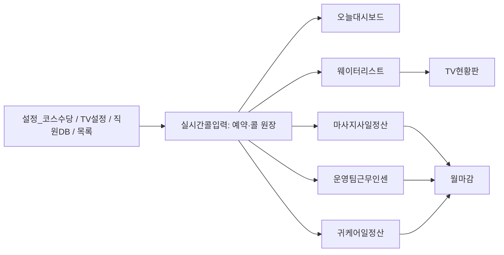

# sheet.xlsx 기반 ERP 설계 문서

이 문서는 제공된 Excel 파일 `sheet.xlsx`의 전체 워크북 구조를 분석해, 새 ERP 구축 시 사용할 업무/데이터/계산 규칙으로 재정리한 설계 문서입니다. 반복 셀 수식은 좌표별 전수 나열 대신 반복 범위, 대표 수식, 의존성, 검증 포인트로 압축했습니다.

## 1. 결론 요약

- 워크북은 `실시간콜입력`을 중심 원장으로 두고, `설정_코스수당`, `TV설정`, `직원DB`, `목록`을 마스터/드롭다운으로 사용합니다.
- 운영 화면은 `오늘대시보드`, `웨이터리스트`, `TV현황판`입니다. 정산 화면은 `운영팀근무인센`, `귀케어일정산`, `마사지사일정산`, `월마감`입니다.
- 기준월은 `설정_코스수당!K2` 한 칸에서 제어되며, 날짜 목록과 월별 반복 블록은 이 값을 기준으로 자동 생성됩니다.
- `.xlsx` 내부에 매크로, 피벗, 차트, 엑셀 Table 객체, 외부 연결은 없습니다. 핵심 기능은 수식 36,621개, 계산 체인, 이름 정의, 데이터 유효성 검사, 조건부서식, 숨김 행/열, 병합 셀로 구현되어 있습니다.
- ERP에서는 엑셀 셀 구조를 그대로 복제하기보다, `예약/콜 원장`, `객실 상태`, `직원`, `코스/수당 정책`, `일정산`, `월마감`, `대시보드` 모듈로 정규화해야 합니다.



## 2. 워크북 인벤토리

| 시트 | 표시상태 | 사용범위 | 고정창 | 비어있지 않은 셀 | 수식 셀 | 배열수식 셀 | 검증 규칙 | 조건부서식 범위 | 병합 범위 | 숨김 열 | 숨김 행 수 |
| --- | --- | --- | --- | --- | --- | --- | --- | --- | --- | --- | --- |
| 오늘대시보드 | visible | A1:H24 |  | 47 | 17 | 0 | 1 | 0 | 10 |  | 0 |
| 실시간콜입력 | visible | A1:AA3204 | A12 | 23626 | 19232 | 6200 | 9 | 0 | 162 | K, L | 3060 |
| 웨이터리스트 | visible | A1:L25 | A8 | 151 | 116 | 11 | 0 | 1 | 6 | J, K, L | 0 |
| TV현황판 | visible | A1:L34 | A7 | 71 | 61 | 0 | 0 | 11 | 59 |  | 0 |
| 운영팀근무인센 | visible | A1:M46 | A5 | 433 | 255 | 0 | 1 | 0 | 3 |  | 0 |
| 귀케어일정산 | visible | A1:J220 | A4 | 1149 | 651 | 0 | 1 | 0 | 33 |  | 186 |
| 마사지사일정산 | visible | A1:N1616 | A5 | 17934 | 15872 | 0 | 0 | 0 | 2 |  | 1581 |
| 월마감 | visible | A1:J63 | A5 | 422 | 355 | 0 | 0 | 0 | 3 |  | 0 |
| 직원DB | visible | A1:I69 | A5 | 311 | 0 | 0 | 0 | 0 | 2 |  | 0 |
| TV설정 | visible | A1:H32 |  | 75 | 0 | 0 | 0 | 0 | 1 |  | 0 |
| 설정_코스수당 | visible | A1:N81 | A5 | 546 | 31 | 0 | 0 | 0 | 4 |  | 0 |
| 목록 | hidden | A1:I51 |  | 161 | 31 | 0 | 0 | 0 | 0 |  | 0 |

### 2.1 파일 기능 요소

| 기능 요소 | 개수 | 비고 |
| --- | --- | --- |
| 워크시트 XML | 12 | 시트 12개 |
| 계산 체인 | 1 | 수식 재계산 순서 정보 존재 |
| 엑셀 Table 객체 | 0 | 없음 |
| 차트/드로잉/이미지 | 0 | 없음 |
| 피벗 테이블 | 0 | 없음 |
| 외부 링크/연결 | 0 | 없음 |
| 매크로/VBA | 0 | 없음 |
| 댓글 | 0 | 없음 |

### 2.2 이름 정의

| 이름 | 참조 범위 |
| --- | --- |
| 귀케어목록 | 설정_코스수당!$M$5:$M$8 |
| 날짜목록 | 설정_코스수당!$J$5:$J$35 |
| 마사지사목록 | 설정_코스수당!$N$5:$N$54 |
| 방번호목록 | 설정_코스수당!$L$5:$L$34 |
| 시간목록 | 설정_코스수당!$K$5:$K$35 |
| 코스목록 | 설정_코스수당!$A$6:$A$10 |

### 2.3 숨김/접힘 구조

| 시트 | 숨김 구간 수 | 숨김 행 수 | 대표 구간 |
| --- | --- | --- | --- |
| 실시간콜입력 | 30 | 3060 | 116:217, 219:320, 322:423, 425:526, 528:629, 631:732 ... 2897:2998, 3000:3101, 3103:3204 |
| 귀케어일정산 | 31 | 186 | 5:10, 12:17, 19:24, 26:31, 33:38, 40:45 ... 201:206, 208:213, 215:220 |
| 마사지사일정산 | 31 | 1581 | 6:56, 58:108, 110:160, 162:212, 214:264, 266:316 ... 1462:1512, 1514:1564, 1566:1616 |

해석: `실시간콜입력`은 2일차 이후의 일별 입력 블록을 접어 두는 구조이고, `귀케어일정산`/`마사지사일정산`은 일자별 상세 행을 접어 월별 요약처럼 보이게 만든 구조입니다. ERP에서는 월 화면 안에 일자별 아코디언, 필터, 또는 마스터-디테일 그리드로 구현하는 것이 적절합니다.

## 3. 수식/의존성 전체 분석

| 시트 | 수식 셀 | 배열수식 셀 | 주요 함수 | 참조 시트 |
| --- | --- | --- | --- | --- |
| 오늘대시보드 | 17 | 0 | COUNTIFS(13), SUMIFS(4), DATE(2), YEAR(2), MONTH(2), EDATE(1) | 실시간콜입력(34), 마사지사일정산(4) |
| 실시간콜입력 | 19232 | 6200 | IF(22439), IFERROR(12430), MATCH(12400), DATE(7435), YEAR(7435), MONTH(7435), VLOOKUP(6230), INDEX(6200) | 설정_코스수당(39700) |
| 웨이터리스트 | 116 | 11 | IFERROR(121), LOOKUP(99), IF(65), TIMEVALUE(11), INDEX(11), MATCH(11), COUNTIF(5), TODAY(3) | 실시간콜입력(495), TV설정(22) |
| TV현황판 | 61 | 0 | IF(77), OR(11) | 웨이터리스트(138) |
| 운영팀근무인센 | 255 | 0 | IF(135), DATE(62), YEAR(62), MONTH(62), DAY(31), COUNTIFS(31), SUM(1) | 설정_코스수당(325), 실시간콜입력(62) |
| 귀케어일정산 | 651 | 0 | IF(403), DATE(310), YEAR(310), MONTH(310), COUNTIFS(248), DAY(155), SUMIFS(124), TEXT(31) | 실시간콜입력(744), 설정_코스수당(620) |
| 마사지사일정산 | 15872 | 0 | COUNTIFS(15500), DATE(3162), YEAR(3162), MONTH(3162), SUMIFS(3100), IF(1829), DAY(1581), AND(124) | 실시간콜입력(74400), 설정_코스수당(6324) |
| 월마감 | 355 | 0 | SUMIFS(100), COUNTIFS(52), IF(10), SUM(3) | 마사지사일정산(300), 운영팀근무인센(3), 귀케어일정산(1) |
| 직원DB | 0 | 0 |  |  |
| TV설정 | 0 | 0 |  |  |
| 설정_코스수당 | 31 | 0 | DATE(62), YEAR(62), MONTH(62), IF(31), DAY(31) | 설정_코스수당(124) |
| 목록 | 31 | 0 | DATE(62), YEAR(62), MONTH(62), IF(31), DAY(31) | 설정_코스수당(124) |

### 3.1 사용 함수 목록

| 함수 | 검출 횟수 |
| --- | --- |
| IF | 25020 |
| COUNTIFS | 16288 |
| IFERROR | 12582 |
| MATCH | 12411 |
| DATE | 11095 |
| YEAR | 11095 |
| MONTH | 11095 |
| VLOOKUP | 6230 |
| INDEX | 6211 |
| DAY | 5515 |
| SUMIFS | 3456 |
| OR | 3141 |
| MAX | 3131 |
| TEXT | 156 |
| SUM | 129 |
| AND | 125 |
| LOOKUP | 99 |
| COUNTIF | 98 |
| ISNUMBER | 62 |
| AVERAGEIF | 31 |
| EDATE | 17 |
| TIMEVALUE | 11 |
| TODAY | 3 |
| NOW | 2 |
| TIME | 2 |
| ROUND | 1 |
| MOD | 1 |

기능적 의미:

- `COUNTIFS`, `SUMIFS`: 예약상태, 날짜, 코스, 담당자별 집계의 대부분을 담당합니다.
- `IF`, `IFERROR`, `AND`, `OR`, `ISNUMBER`: 상태별 계산 분기, 공백 처리, 만근 인정 조건을 담당합니다.
- `INDEX`/`MATCH`, `VLOOKUP`, `LOOKUP`: 코스 수당표, 객실 상태의 마지막 입력값, 코스 시간 조회에 사용됩니다.
- `DATE`, `YEAR`, `MONTH`, `DAY`, `EDATE`, `TODAY`, `NOW`, `TIME`, `TIMEVALUE`, `MOD`: 기준월 날짜 생성, 객실 남은 시간, 야간 자정 초과 처리를 담당합니다.
- `TEXT`, `SUM`, `MAX`, `ROUND`, `AVERAGEIF`, `COUNTIF`: 표시 문구, 합계, 할인 후 결제금액, 대기시간 평균, 출근/만근 수 계산에 사용됩니다.

## 4. 데이터 유효성 검사와 조건부서식

### 4.1 드롭다운/검증 규칙

| 시트 | 유형 | 적용 범위 | 원천/목록 | 공백 허용 |
| --- | --- | --- | --- | --- |
| 오늘대시보드 | list (x14) | B3 | 설정_코스수당!$J$6:$J$35 | Y |
| 실시간콜입력 | list | P14:P3204 | "일주일내방문,생일자,후기작성" | Y |
| 실시간콜입력 | list | Q14:Q3204 | "현금,카드,계좌,기타" | Y |
| 실시간콜입력 | list (x14) | I14:I114 I116:I217 I219:I320 I322:I423 I425:I526 I528:I629 I631:I732 I734:I835 I837:I938 I940:I1041 I1043:I1144 I1146:I1247 I1249:I1350 I1352:I1453 I1455:I1556 I1558:I1659 I1661:I1762 I1764:I1865 I1867:I1968 I1970:I2071 I2073:I2174 I2176:I2277 I2279:I2380 I2382:I2483 I2485:I2586 I2588:I2689 I2691:I2792 I2794:I2895 I2897:I2998 I3000:I3101 I3103:I3204 | 목록!$I$2:$I$51 | Y |
| 실시간콜입력 | list (x14) | D14:D114 D116:D217 D219:D320 D322:D423 D425:D526 D528:D629 D631:D732 D734:D835 D837:D938 D940:D1041 D1043:D1144 D1146:D1247 D1249:D1350 D1352:D1453 D1455:D1556 D1558:D1659 D1661:D1762 D1764:D1865 D1867:D1968 D1970:D2071 D2073:D2174 D2176:D2277 D2279:D2380 D2382:D2483 D2485:D2586 D2588:D2689 D2691:D2792 D2794:D2895 D2897:D2998 D3000:D3101 D3103:D3204 | TV설정!$A$4:$A$14 | Y |
| 실시간콜입력 | list (x14) | E14:E114 E116:E217 E219:E320 E322:E423 E425:E526 E528:E629 E631:E732 E734:E835 E837:E938 E940:E1041 E1043:E1144 E1146:E1247 E1249:E1350 E1352:E1453 E1455:E1556 E1558:E1659 E1661:E1762 E1764:E1865 E1867:E1968 E1970:E2071 E2073:E2174 E2176:E2277 E2279:E2380 E2382:E2483 E2485:E2586 E2588:E2689 E2691:E2792 E2794:E2895 E2897:E2998 E3000:E3101 E3103:E3204 | TV설정!$D$4:$D$8 | Y |
| 실시간콜입력 | list (x14) | C14:C114 C116:C217 C219:C320 C322:C423 C425:C526 C528:C629 C631:C732 C734:C835 C837:C938 C940:C1041 C1043:C1144 C1146:C1247 C1249:C1350 C1352:C1453 C1455:C1556 C1558:C1659 C1661:C1762 C1764:C1865 C1867:C1968 C1970:C2071 C2073:C2174 C2176:C2277 C2279:C2380 C2382:C2483 C2485:C2586 C2588:C2689 C2691:C2792 C2794:C2895 C2897:C2998 C3000:C3101 C3103:C3204 | TV설정!$C$4:$C$32 | Y |
| 실시간콜입력 | list (x14) | G14:H114 G116:H217 G219:H320 G322:H423 G425:H526 G528:H629 G631:H732 G734:H835 G837:H938 G940:H1041 G1043:H1144 G1146:H1247 G1249:H1350 G1352:H1453 G1455:H1556 G1558:H1659 G1661:H1762 G1764:H1865 G1867:H1968 G1970:H2071 G2073:H2174 G2176:H2277 G2279:H2380 G2382:H2483 G2485:H2586 G2588:H2689 G2691:H2792 G2794:H2895 G2897:H2998 G3000:H3101 G3103:H3204 | 목록!$H$2:$H$51 | Y |
| 실시간콜입력 | list (x14) | S14:S3204 | 목록!$G$2:$G$51 | Y |
| 실시간콜입력 | list (x14) | O14:O3204 | TV설정!$B$4:$B$9 | Y |
| 운영팀근무인센 | list | D5:D35 F5:F35 H5:H35 J5:J35 L5:L35 | "정상,휴무,지각,조퇴,결근" | Y |
| 귀케어일정산 | list | C6:C10 C12:C17 C19:C24 C26:C31 C33:C38 C40:C45 C47:C52 C54:C59 C61:C66 C68:C73 C75:C80 C82:C87 C89:C94 C96:C101 C103:C108 C110:C115 C117:C122 C124:C129 C131:C136 C138:C143 C145:C150 C152:C157 C159:C163 C167:C170 C174:C177 C181:C184 C188:C191 C195:C198 C202:C205 C209:C212 C216:C219 | "정상,휴무,지각,조퇴,결근" | Y |

### 4.2 조건부서식

| 시트 | 적용 범위 | 규칙 수 | 대표 조건 |
| --- | --- | --- | --- |
| 웨이터리스트 | A9:I19 | 5 | $B9="사용중" / $B9="청소중" / $B9="예약" / $B9="종료확인" / $B9="빈방" |
| TV현황판 | A7:C11 | 5 | $A$8="사용중" / $A$8="청소중" / $A$8="예약" / $A$8="종료확인" / $A$8="빈방" |
| TV현황판 | D7:F11 | 5 | $D$8="사용중" / $D$8="청소중" / $D$8="예약" / $D$8="종료확인" / $D$8="빈방" |
| TV현황판 | A13:C17 | 5 | $A$14="사용중" / $A$14="청소중" / $A$14="예약" / $A$14="종료확인" / $A$14="빈방" |
| TV현황판 | D13:F17 | 5 | $D$14="사용중" / $D$14="청소중" / $D$14="예약" / $D$14="종료확인" / $D$14="빈방" |
| TV현황판 | G13:I17 | 5 | $G$14="사용중" / $G$14="청소중" / $G$14="예약" / $G$14="종료확인" / $G$14="빈방" |
| TV현황판 | A19:C23 | 5 | $A$20="사용중" / $A$20="청소중" / $A$20="예약" / $A$20="종료확인" / $A$20="빈방" |
| TV현황판 | D19:F23 | 5 | $D$20="사용중" / $D$20="청소중" / $D$20="예약" / $D$20="종료확인" / $D$20="빈방" |
| TV현황판 | G19:I23 | 5 | $G$20="사용중" / $G$20="청소중" / $G$20="예약" / $G$20="종료확인" / $G$20="빈방" |
| TV현황판 | A25:C29 | 5 | $A$26="사용중" / $A$26="청소중" / $A$26="예약" / $A$26="종료확인" / $A$26="빈방" |
| TV현황판 | D25:F29 | 5 | $D$26="사용중" / $D$26="청소중" / $D$26="예약" / $D$26="종료확인" / $D$26="빈방" |
| TV현황판 | G25:I29 | 5 | $G$26="사용중" / $G$26="청소중" / $G$26="예약" / $G$26="종료확인" / $G$26="빈방" |

ERP 해석: 상태값에 따라 색상이 바뀌는 객실 현황판 기능입니다. 프론트엔드에서는 상태 코드별 배지/카드 색상으로 구현하고, 색상 로직은 `예약`, `사용중`, `청소중`, `종료확인`, `빈방` 상태 enum에 묶어야 합니다.

## 5. 마스터/기준 데이터

### 5.1 코스 기본 설정

| 코스코드 | 코스명 | 시간(분) | 기본판매가 | 운영팀 콜인정 | 귀케어 풀/콜 | 마사지사2 필요 | 메모 |
| --- | --- | --- | --- | --- | --- | --- | --- |
| A | 60분 A코스 누루마사지 | 60 | 1500000 | 1 | 0 | N |  |
| B | 90분 B코스 귀청소+마사지 | 90 | 1800000 | 1 | 100000 | N | 귀케어 수당은 일별 N분의1 |
| C | 90분 C코스 때밀이+마사지 | 90 | 2000000 | 1 | 0 | N |  |
| D | 90분 D코스 2:1 코스 | 90 | 3200000 | 1 | 0 | Y | 마사지사 2명 가능 |
| E | 120분 E코스 풀코스 패키지 | 120 | 3000000 | 1 | 100000 | N | 귀케어 포함 |

### 5.2 객실, 상태, 시간

| 객실 |
| --- |
| 101 호실 |
| 102 호실 |
| 103 호실 |
| 201 호실 |
| 202 호실 |
| 203 호실 |
| 301 호실 |
| 302 호실 |
| 303 호실 |
| 401 호실 |
| 402 호실 |

- 예약/콜 상태: `예약`, `사용중`, `청소중`, `방문완료`, `노쇼`, `취소`
- 시간 목록: `실시간콜입력` 드롭다운은 `TV설정!C4:C32` 기준 `11:00`~`01:00` 30분 단위 총 29개 값입니다. 이름 정의 `시간목록`은 `설정_코스수당!K5:K35` 기준 `11:00`~`02:00` 총 31개 값이라 서로 다릅니다.

### 5.3 TV 표시용 코스명

| 코스코드 | 코스시간(분) | TV표시명 | 코스명 |
| --- | --- | --- | --- |
| A | 60 | A 누루60 | 60분 A코스 누루마사지 |
| B | 90 | B 귀청소90 | 90분 B코스 귀청소+마사지 |
| C | 90 | C 때밀이90 | 90분 C코스 때밀이+마사지 |
| D | 90 | D 2:1 90 | 90분 D코스 2:1 코스 |
| E | 120 | E 풀코스120 | 120분 E코스 풀코스 패키지 |

### 5.4 운영팀 일일 인센 기준

| 일 총콜 이상 | 개인별 지급액 | 운영팀 5명 총액 | 메모 |
| --- | --- | --- | --- |
| 30 | 50000 | 250000 | 30콜 달성 |
| 40 | 100000 | 500000 | 40콜 달성 |
| 50 | 200000 | 1000000 | 50콜 달성 |

### 5.5 운영팀 월 인센 기준

| 월 총콜 이상 | 운영팀 전체 월인센 | 팀장% | 카운터팀% | 웨이터팀% |
| --- | --- | --- | --- | --- |
| 1000 | 3000000 | 0.3 | 0.35 | 0.35 |
| 1100 | 5000000 | 0.3 | 0.35 | 0.35 |
| 1200 | 8000000 | 0.3 | 0.35 | 0.35 |
| 1300 | 12000000 | 0.3 | 0.35 | 0.35 |
| 1400 | 18000000 | 0.3 | 0.35 | 0.35 |
| 1500 | 25000000 | 0.3 | 0.35 | 0.35 |

### 5.6 직원 DB

| 구분 | 인원 수 |
| --- | --- |
| 운영팀 | 5 |
| 귀케어팀 | 4 |
| 마사지사 | 50 |

대표 행:

| 구분 | 이름 | 직책 | 주/야간 | 기본급 | 연락처 | 생일 | 입사일 | 상태 |
| --- | --- | --- | --- | --- | --- | --- | --- | --- |
| 운영팀 | 팀장 | 팀장 | 전체 | 22000000 |  |  |  | 재직 |
| 운영팀 | 카운터1 | 카운터 | 주간 | 12000000 |  |  |  | 재직 |
| 운영팀 | 카운터2 | 카운터 | 야간 | 12000000 |  |  |  | 재직 |
| 운영팀 | 웨이터1 | 웨이터 | 주간 | 9000000 |  |  |  | 재직 |
| 운영팀 | 웨이터2 | 웨이터 | 야간 | 9000000 |  |  |  | 재직 |
| 귀케어팀 | 귀케어1 | 귀케어사 |  | 5000000 |  |  |  | 재직 |
| 귀케어팀 | 귀케어2 | 귀케어사 |  | 5000000 |  |  |  | 재직 |
| 귀케어팀 | 귀케어3 | 귀케어사 |  | 5000000 |  |  |  | 재직 |
| 귀케어팀 | 귀케어4 | 귀케어사 |  | 5000000 |  |  |  | 재직 |
| 마사지사 | 마사지사1 | 마사지사 |  | 0 |  |  |  | 재직 |
| 마사지사 | 마사지사2 | 마사지사 |  | 0 |  |  |  | 재직 |
| 마사지사 | 마사지사50 | 마사지사 |  | 0 |  |  |  | 재직 |

### 5.7 마사지사 개인별 코스 수당표

`설정_코스수당!A15:F64`는 마사지사 50명의 A~E 코스별 개인 수당을 저장합니다. 현재 `마사지사1`~`마사지사4`는 A/B/C 수당이 입력되어 있고, 다수의 나머지 행은 0으로 초기화되어 있습니다.

| 마사지사 | A수당 | B수당 | C수당 | D수당 | E수당 |
| --- | --- | --- | --- | --- | --- |
| 마사지사1 | 700000 | 900000 | 900000 | 0 | 0 |
| 마사지사2 | 700000 | 900000 | 900000 | 0 | 0 |
| 마사지사3 | 700000 | 900000 | 900000 | 0 | 0 |
| 마사지사4 | 700000 | 900000 | 900000 | 0 | 0 |
| 마사지사5 | 0 | 0 | 0 | 0 | 0 |
| 마사지사6 | 0 | 0 | 0 | 0 | 0 |
| 마사지사7 | 0 | 0 | 0 | 0 | 0 |
| 마사지사8 | 0 | 0 | 0 | 0 | 0 |
| 마사지사9 | 0 | 0 | 0 | 0 | 0 |
| 마사지사10 | 0 | 0 | 0 | 0 | 0 |
| 마사지사11 | 0 | 0 | 0 | 0 | 0 |
| 마사지사12 | 0 | 0 | 0 | 0 | 0 |
| 마사지사13 | 0 | 0 | 0 | 0 | 0 |
| 마사지사14 | 0 | 0 | 0 | 0 | 0 |
| 마사지사15 | 0 | 0 | 0 | 0 | 0 |
| 마사지사16 | 0 | 0 | 0 | 0 | 0 |
| 마사지사17 | 0 | 0 | 0 | 0 | 0 |
| 마사지사18 | 0 | 0 | 0 | 0 | 0 |
| 마사지사19 | 0 | 0 | 0 | 0 | 0 |
| 마사지사20 | 0 | 0 | 0 | 0 | 0 |
| 마사지사21 | 0 | 0 | 0 | 0 | 0 |
| 마사지사22 | 0 | 0 | 0 | 0 | 0 |
| 마사지사23 | 0 | 0 | 0 | 0 | 0 |
| 마사지사24 | 0 | 0 | 0 | 0 | 0 |
| 마사지사25 | 0 | 0 | 0 | 0 | 0 |
| 마사지사26 | 0 | 0 | 0 | 0 | 0 |
| 마사지사27 | 0 | 0 | 0 | 0 | 0 |
| 마사지사28 | 0 | 0 | 0 | 0 | 0 |
| 마사지사29 | 0 | 0 | 0 | 0 | 0 |
| 마사지사30 | 0 | 0 | 0 | 0 | 0 |
| 마사지사31 | 0 | 0 | 0 | 0 | 0 |
| 마사지사32 | 0 | 0 | 0 | 0 | 0 |
| 마사지사33 | 0 | 0 | 0 | 0 | 0 |
| 마사지사34 | 0 | 0 | 0 | 0 | 0 |
| 마사지사35 | 0 | 0 | 0 | 0 | 0 |
| 마사지사36 | 0 | 0 | 0 | 0 | 0 |
| 마사지사37 | 0 | 0 | 0 | 0 | 0 |
| 마사지사38 | 0 | 0 | 0 | 0 | 0 |
| 마사지사39 | 0 | 0 | 0 | 0 | 0 |
| 마사지사40 | 0 | 0 | 0 | 0 | 0 |
| 마사지사41 | 0 | 0 | 0 | 0 | 0 |
| 마사지사42 | 0 | 0 | 0 | 0 | 0 |
| 마사지사43 | 0 | 0 | 0 | 0 | 0 |
| 마사지사44 | 0 | 0 | 0 | 0 | 0 |
| 마사지사45 | 0 | 0 | 0 | 0 | 0 |
| 마사지사46 | 0 | 0 | 0 | 0 | 0 |
| 마사지사47 | 0 | 0 | 0 | 0 | 0 |
| 마사지사48 | 0 | 0 | 0 | 0 | 0 |
| 마사지사49 | 0 | 0 | 0 | 0 | 0 |
| 마사지사50 | 0 | 0 | 0 | 0 | 0 |

## 6. 권장 ERP 도메인 모델

| 도메인 | 핵심 엔티티 | 원본 시트/범위 | 설명 |
| --- | --- | --- | --- |
| 설정 | OperatingMonth | 설정_코스수당!K2 | 기준월. 모든 날짜 생성과 월 집계의 기준입니다. |
| 상품/코스 | Course, CourseDisplay | 설정_코스수당!A6:H10, TV설정!D4:G8 | 코스코드, 시간, 가격, 귀케어 풀, 2인 필요 여부, TV 표시명을 관리합니다. |
| 객실 | Room | TV설정!A4:A14, 방번호목록 | 객실 번호와 화면 표시명을 관리합니다. |
| 직원 | Employee, Therapist, EarCareStaff | 직원DB, 설정_코스수당!N5:N54 | 운영팀, 귀케어팀, 마사지사를 하나의 직원 마스터와 역할로 분리합니다. |
| 수당 정책 | TherapistCourseRate, OpsDailyIncentiveRule, OpsMonthlyIncentiveRule | 설정_코스수당!A15:F64, A69:E81 | 개인별 코스 수당과 운영팀 인센 기준입니다. |
| 예약/콜 | ServiceCall | 실시간콜입력 A:S | 고객 방문/예약/노쇼/취소 원장입니다. ERP의 가장 중요한 트랜잭션 테이블입니다. |
| 지출 | DailyExpense | 실시간콜입력 U:X 일별 지출 입력 | 일자별 지출금액, 내용, 담당자, 비고입니다. |
| 객실 현황 | RoomStatusSnapshot 또는 RoomStatusView | 웨이터리스트, TV현황판 | 원장 입력값에서 객실별 최신 상태와 남은 시간을 계산한 조회 모델입니다. |
| 일정산 | TherapistDailySettlement, EarCareDailySettlement, OpsDailyIncentive | 마사지사일정산, 귀케어일정산, 운영팀근무인센 | 방문완료 콜 기준으로 일별 지급액과 출근 상태를 계산합니다. |
| 월마감 | MonthlyClose, MonthlyPayout | 월마감 | 마사지사/운영팀/귀케어 월 지급액과 보너스를 확정합니다. |
| 대시보드 | DashboardMetric | 오늘대시보드 | 운영자가 보는 당일/월간 KPI 조회 모델입니다. |

## 7. 시트별 상세 설계

### 7.1 오늘대시보드

- 역할: 당일 운영 KPI와 월간 KPI를 한 화면에서 보는 실시간 대시보드입니다.
- 입력: `B3` 조회날짜. 현재 값은 `2026-06-03 00:00:00`입니다.
- 원천: `실시간콜입력`, `마사지사일정산`.
- 표시 그룹: 오늘 상태 요약, 방문완료 코스별, 월간 상태 요약.
- 주요 KPI: 오늘 예약건수, 방문완료 콜, 노쇼, 취소, 결제합계, 마사지사 담당콜, 마사지사 정산, 코스 A~E별 방문완료, 월 방문완료/예약/노쇼/취소/매출.
- ERP 구현: `/dashboard/today?date=YYYY-MM-DD` 형태의 조회 API가 `ServiceCall`과 `TherapistDailySettlement`를 집계해 반환하면 됩니다.

### 7.2 실시간콜입력

- 역할: 예약/방문/정산의 중심 원장입니다. 하루 100개 슬롯, 월 최대 31일 구조입니다.
- 반복 구조: 일자 블록 31개. 첫 블록 시작 행 `12`, 마지막 블록 시작 행 `3102`, 마지막 입력 슬롯 종료 행 `3203`입니다.
- 일자 블록 공식: `블록시작행 = 12 + 103 × (일자-1)`, `헤더행 = 시작+1`, `입력행 = 시작+2 ~ 시작+101`, `일일 입력 끝 = 시작+102`.
- 고정창: `A12`. 실제 업무자는 월간 요약 영역을 고정하고 일별 블록을 펼쳐 입력합니다.
- 숨김/접힘: 2일차 이후 블록 대부분이 숨김 처리되어 있습니다. ERP에서는 날짜 탭, 월 캘린더, 일자별 접힘 그리드 중 하나로 구현합니다.

| 컬럼 | 원본 헤더 | ERP 필드 | 입력/계산 | 규칙 |
| --- | --- | --- | --- | --- |
| A | 번호 | slot_no | 계산/표시 | 일별 1~100 슬롯 번호 |
| B | 날짜 | service_date | 계산 | `설정_코스수당!K2` 기준월과 일자 블록으로 생성 |
| C | 시간 | start_time | 입력 | 드롭다운 `TV설정!C4:C32` |
| D | 방번호 | room_id | 입력 | 드롭다운 `TV설정!A4:A14` |
| E | 코스 | course_code | 입력 | 드롭다운 `TV설정!D4:D8` |
| F | 고객/메모 | customer_memo | 입력 | 고객명 또는 메모성 텍스트 |
| G | 마사지사1 | therapist_1_id | 입력 | 드롭다운 `목록!H2:H51` |
| H | 마사지사2 | therapist_2_id | 입력 | 2인 코스 또는 보조 담당자 |
| I | 귀케어담당 | earcare_staff_id | 입력 | 드롭다운 `목록!I2:I51` |
| J | 결제금액 | payment_amount | 계산 | 방문완료일 때 코스 기본판매가에서 할인 100,000 차감 |
| K | 마사지사1수당 | therapist_1_commission | 계산/숨김 | 마사지사별 코스 수당표 `A15:F64`에서 INDEX/MATCH |
| L | 마사지사2수당 | therapist_2_commission | 계산/숨김 | 마사지사2가 없으면 0, 있으면 개인별 코스 수당 |
| M | 귀케어풀 | earcare_pool_amount | 계산 | 방문완료일 때 코스별 귀케어 풀/콜 금액 |
| N | 콜인정 | recognized_call_count | 계산 | 방문완료면 1, 아니면 0 |
| O | 예약상태 | reservation_status | 입력 | `예약`, `사용중`, `청소중`, `방문완료`, `노쇼`, `취소` |
| P | 할인구분 | discount_type | 입력 | `일주일내방문`, `생일자`, `후기작성` |
| Q | 결제수단 | payment_method | 입력 | `현금`, `카드`, `계좌`, `기타` |
| R | 비고 | note | 입력 | 운영 메모 |
| S | 확인 | confirmed_flag | 입력 | `목록!G2:G51` 기반 Y/N 확인 |

일별 사이드 요약/지출 구조:

- `U:V`: 예약건수, 방문완료, 노쇼/취소, 결제합계, 마사지사 정산, 귀케어풀, 할인합계, 지출합계, 순매출 문구를 일자별로 계산합니다.
- `W:X`: A~E 코스별 방문완료 수, 할인건수, 마사지사담당 수를 계산합니다.
- `U:X` 하단: 지출금액, 내용, 담당자, 비고를 일별로 8행 입력하는 구조입니다.

대표 계산 규칙:

```text
결제금액 = 방문완료 ? max(0, 코스 기본판매가 - 할인금액) : 0
할인금액 = 할인구분이 공백 또는 없음이면 0, 아니면 100000
마사지사수당 = 방문완료 ? 개인별 코스 수당표[마사지사, 코스] : 0
귀케어풀 = 방문완료 ? 코스별 귀케어 풀/콜 : 0
콜인정 = 방문완료 ? 1 : 0
월 순매출 = 월 결제합계 - 월 마사지사정산 - 월 귀케어풀 - 월 할인합계 - 월 지출합계
```

마이그레이션 검증 포인트: `실시간콜입력`의 실제 31일차 입력 슬롯은 `3104:3203`까지 존재하지만, 상단 월간 요약 수식 일부는 `$14:$3113`까지만 참조합니다. 새 ERP에서는 셀 범위가 아니라 `service_date between 월초 and 익월초` 조건으로 집계해야 이 누락 위험이 사라집니다.

### 7.3 웨이터리스트

- 역할: 웨이터가 보는 객실별 현재 상태판입니다. `A9:L19`에 11개 객실을 표시합니다.
- 원천: `실시간콜입력`의 방번호/상태/코스/담당자/시간, `TV설정`의 코스시간.
- 숨김 열: `J:K:L`은 기본상태, 코스시간, 시작일시 계산용 보조 열입니다.
- 상태 계산: 객실별 최신 `사용중`, `청소중`, `예약` 레코드를 `LOOKUP(2,1/(조건),값)` 패턴으로 찾습니다. 상태가 `사용중`이고 남은분이 0이면 `종료확인`으로 표시합니다.
- 남은 시간: 시작시각 + 코스시간 - 현재시각(`NOW`)으로 계산하며, 새벽 3시 전후 자정 초과를 보정합니다.
- ERP 구현: `GET /rooms/status?at=now` 조회 모델. 원장은 변경하지 않고 상태 조회를 계산 또는 캐시합니다.

### 7.4 TV현황판

- 역할: 카운터 TV 전체화면용 객실 카드 화면입니다.
- 원천: `웨이터리스트`. 직접 원장을 다시 계산하지 않고 웨이터리스트의 결과를 참조합니다.
- 구조: 11개 객실 카드, 각 카드에 방번호, 상태, 남은시간, 코스, 담당자를 표시합니다.
- 조건부서식: 카드별 상태셀에 따라 `사용중`, `청소중`, `예약`, `종료확인`, `빈방` 색상이 적용됩니다.
- ERP 구현: 운영용 대형 모니터 라우트(`/display/rooms`)로 분리하고, 상태별 컬러 토큰을 공통화합니다.

### 7.5 운영팀근무인센

- 역할: 운영팀 5명(팀장, 카운터1/2, 웨이터1/2)의 일별 출근상태, 일일인센, 월인센을 계산합니다.
- 일별 범위: `A5:M35`, 기준월 최대 31일.
- 입력: 각 직원 상태 컬럼 `D/F/H/J/L`에서 `정상, 휴무, 지각, 조퇴, 결근` 선택.
- 일일 총콜: 해당일 `실시간콜입력`의 방문완료 수.
- 일일 개인 인센: 총콜이 30/40/50 이상이면 각각 50,000/100,000/200,000. 정상 근무자만 지급, 지각·조퇴·결근은 0원.
- 월 인센: `B40` 월 총콜을 기준으로 1,000~1,500콜 구간의 전체 월인센을 결정하고, 팀장 30%, 카운터팀 35%, 웨이터팀 35%로 분배합니다.
- ERP 구현: `ops_attendance`, `ops_daily_incentive`, `ops_monthly_incentive`로 분리합니다.

### 7.6 귀케어일정산

- 역할: B코스 방문완료 기준 귀케어 풀을 정상 근무자 수로 N분의1 배분합니다.
- 구조: 월 31개 일자 블록. 각 일자마다 귀케어1~귀케어4 상세 행과 1개 빈 행이 있습니다.
- 입력: `근무상태`에서 `정상, 휴무, 지각, 조퇴, 결근` 선택.
- 계산: `당일 B콜`은 `실시간콜입력`에서 해당일 B코스 방문완료 수, `당일 귀케어풀`은 해당일 `M`열 합계, `정상근무자수`는 같은 일자의 정상 상태 인원 수, `1인 지급액`은 정상 상태일 때 `귀케어풀 / 정상근무자수`입니다.
- ERP 구현: `earcare_attendance`와 `earcare_daily_settlement`를 분리하고, 정산 확정 전에는 정책 변경 시 재계산 가능해야 합니다.

### 7.7 마사지사일정산

- 역할: 마사지사 50명의 일별 출퇴근, 대기시간, 코스별 담당 콜, 당일 정산액, 만근 인정 여부를 계산합니다.
- 구조: 월 31개 일자 블록. 각 블록은 1개 요약 행 + 1개 헤더 행 + 50명 상세 행입니다.
- 입력: 마사지사별 출근시간 `C`, 퇴근시간 `D`. 대기시간은 자동 계산됩니다.
- 코스별 담당 콜: `실시간콜입력`에서 해당일, 해당 코스, 해당 마사지사가 `마사지사1` 또는 `마사지사2`로 들어간 방문완료 콜을 합산합니다.
- 당일정산: `실시간콜입력`의 `K`/`L` 수당 열에서 해당 마사지사가 담당한 금액을 합산합니다.
- 만근인정: 대기시간이 숫자이고 8시간 이상이면 `인정`입니다.
- ERP 구현: `therapist_shift`, `therapist_call_assignment`, `therapist_daily_settlement`로 분리합니다. 출퇴근 입력과 콜 배정은 독립 트랜잭션이어야 합니다.

### 7.8 월마감

- 역할: 마사지사 월 총콜, 월 정산액, 만근수당, 갯수왕 수당, 운영팀/귀케어 합계를 한 번에 보는 월마감 화면입니다.
- 마사지사 범위: `A5:H54`, 50명.
- 마사지사 월 총콜/정산액: `마사지사일정산`의 총콜/당일정산을 마사지사별로 합산합니다.
- 만근수당: 만근 인정일이 20일 이상이면 2,000,000 지급.
- 갯수왕: 월 총콜 40콜 이상만 대상이며, 순위 1/2/3위에 5,000,000 / 3,000,000 / 1,000,000 지급.
- 최종지급액: 월 정산액 + 만근수당 + 갯수왕수당.
- 운영팀 요약: 운영팀 월 총콜, 월인센 전체, 일일인센 합계.
- 귀케어 지급 합계: `귀케어일정산!G:G` 합계.
- ERP 구현: 월마감은 “계산 미리보기 → 검토 → 확정/잠금 → 회계/지급 내보내기” 상태 전이를 가져야 합니다.

### 7.9 직원DB

- 역할: 직원 마스터입니다. 이름은 다른 시트의 드롭다운/수당표와 연결됩니다.
- 컬럼: 구분, 이름, 직책, 주/야간, 기본급, 연락처, 생일, 입사일, 상태.
- 현재 구조: 운영팀 5명, 귀케어팀 4명, 마사지사 50명.
- ERP 구현: `employees` 테이블에 role/type/status를 두고, 마사지사/귀케어/운영팀 세부 속성은 역할별 확장 테이블로 분리합니다.

### 7.10 TV설정

- 역할: 객실 목록, 예약상태 목록, 시간 목록, TV 표시용 코스명을 제공합니다.
- 객실: 101/102/103/201/202/203/301/302/303/401/402 호실.
- 상태: 예약, 사용중, 청소중, 방문완료, 노쇼, 취소.
- 시간: `TV설정`의 입력 드롭다운 원천은 11:00부터 01:00까지 30분 간격이고, `설정_코스수당`의 이름 정의 시간목록은 02:00까지 포함합니다.
- ERP 구현: 화면별 표시명과 업무 상태 enum을 별도 설정으로 둡니다.

### 7.11 설정_코스수당

- 역할: 기준월, 코스, 가격, 수당, 드롭다운 원천, 운영팀 인센 기준을 관리하는 핵심 설정 시트입니다.
- 기준월: `K2`. 문서 분석 시점의 원본 값은 `2026-06-01 00:00:00`입니다.
- 날짜목록: `J5:J35`가 기준월 일자를 자동 생성합니다.
- 시간목록: `K5:K35`, 방번호목록: `L5:L34`, 귀케어목록: `M5:M8`, 마사지사목록: `N5:N54`.
- 코스 기본 설정: `A6:H10`. 개인별 코스 수당표: `A15:F64`. 운영팀 인센 기준: `A69:E81`.
- ERP 구현: 설정 변경 이력과 적용 시작월을 반드시 가져야 합니다. 과거 월 정산이 현재 설정 변경으로 흔들리면 안 됩니다.

### 7.12 목록

- 표시상태: 숨김 시트.
- 역할: 날짜, 시간, 방번호, 코스, 예약상태, 결제수단, 확인, 마사지사, 귀케어 드롭다운 값을 모아둔 보조 목록입니다.
- 주의: 일부 목록 값은 `TV설정`/`설정_코스수당`과 표현이 다릅니다. 예를 들어 방번호는 `목록`에서는 `1번방` 형식이고, 운영 화면은 `101 호실` 형식입니다. ERP에서는 단일 Room ID와 표시명을 분리해야 합니다.

## 8. 핵심 업무 흐름

### 8.1 예약/콜 입력

1. 운영자가 날짜 블록을 펼칩니다.
2. 시간, 방번호, 코스, 마사지사1/2, 귀케어 담당, 상태, 결제수단 등을 입력합니다.
3. 상태가 `방문완료`가 되면 결제금액, 마사지사 수당, 귀케어 풀, 콜인정이 자동 계산됩니다.
4. 대시보드, 웨이터리스트, 정산 시트가 같은 원장을 즉시 참조합니다.

### 8.2 객실 상태

1. 객실별 최신 예약/사용중/청소중 레코드를 찾습니다.
2. 코스 시간과 시작시간으로 종료예정/남은분을 계산합니다.
3. `사용중`이면서 남은분이 0이면 `종료확인` 상태로 전환 표시합니다.
4. TV현황판은 같은 결과를 큰 카드 UI로 표시합니다.

### 8.3 일일 정산

- 운영팀: 방문완료 총콜과 출근상태로 일일 개인 인센을 계산합니다.
- 귀케어: B코스 방문완료의 귀케어 풀을 정상 근무자에게 균등 배분합니다.
- 마사지사: 담당 콜 수, 개인별 수당표, 출퇴근 대기시간으로 당일정산과 만근인정을 계산합니다.

### 8.4 월마감

1. 마사지사별 월 총콜/정산액/만근일을 집계합니다.
2. 만근수당과 갯수왕 TOP3 수당을 더해 최종 지급액을 계산합니다.
3. 운영팀 월인센, 운영팀 일일인센 합계, 귀케어 지급 합계를 같이 확인합니다.
4. ERP에서는 마감 확정 후 원장/설정 변경이 해당 월 지급액에 영향을 주지 않도록 스냅샷을 저장해야 합니다.

## 9. ERP 테이블 초안

| 테이블 | 주요 필드 | 비고 |
| --- | --- | --- |
| operating_months | id, year_month, start_date, end_date, status | 월 단위 기준과 마감 상태 |
| courses | id, code, name, duration_minutes, base_price, ops_call_credit, earcare_pool_amount, requires_second_therapist, active | 코스 마스터 |
| rooms | id, code, display_name, floor, active | 객실 마스터 |
| employees | id, name, role, shift_type, base_salary, phone, birthday, hire_date, employment_status | 직원 공통 마스터 |
| therapist_course_rates | therapist_id, course_id, amount, effective_from_month, effective_to_month | 개인별 코스 수당 |
| ops_incentive_rules | scope, threshold_call_count, amount, leader_ratio, counter_ratio, waiter_ratio, effective_from_month | 일일/월 인센 기준 |
| service_calls | id, service_date, start_time, room_id, course_id, customer_memo, status, discount_type, payment_method, note, confirmed_flag | 실시간콜입력 A:S의 중심 원장 |
| service_call_assignments | service_call_id, employee_id, assignment_role, commission_amount | 마사지사1/2, 귀케어 담당을 정규화 |
| daily_expenses | id, expense_date, amount, description, staff_id, note | 실시간콜입력 U:X 지출 입력 |
| therapist_shifts | work_date, therapist_id, clock_in, clock_out, standby_hours, full_attendance_flag | 마사지사 출퇴근/만근 |
| earcare_attendance | work_date, earcare_staff_id, work_status | 귀케어 근무 상태 |
| ops_attendance | work_date, employee_id, work_status | 운영팀 근무 상태 |
| daily_settlements | work_date, employee_id, role, call_count, settlement_amount, details_json | 일정산 결과 스냅샷 |
| monthly_closings | year_month, status, closed_at, closed_by, total_sales, total_expenses, total_payout | 월마감 헤더 |
| monthly_payouts | monthly_closing_id, employee_id, base_settlement, attendance_bonus, ranking_bonus, ops_bonus, final_amount | 월별 지급액 |

## 10. 계산 엔진 규칙

### 10.1 ServiceCall 정산

```text
if status != 방문완료:
  payment_amount = 0
  recognized_call_count = 0
  therapist commissions = 0
  earcare_pool_amount = 0
else:
  payment_amount = max(0, course.base_price - discount_amount)
  recognized_call_count = 1
  therapist_1_commission = rate(therapist_1, course)
  therapist_2_commission = therapist_2 ? rate(therapist_2, course) : 0
  earcare_pool_amount = course.earcare_pool_amount
```

### 10.2 RoomStatus

```text
latest_active_call = latest call by room where status in (사용중, 청소중, 예약)
base_status = latest_active_call.status or 빈방
remaining_minutes = max(0, round((start_datetime + course.duration - now) minutes))
display_status = 종료확인 if base_status == 사용중 and remaining_minutes == 0 else base_status
```

### 10.3 Therapist Daily Settlement

```text
course_call_count[course] = count completed calls where therapist appears as therapist_1 or therapist_2
total_call_count = sum(course_call_count)
daily_settlement = sum(commission assigned to therapist on completed calls)
standby_hours = clock_out >= clock_in ? clock_out - clock_in : clock_out + 24h - clock_in
full_attendance = standby_hours >= 8
```

### 10.4 Earcare Daily Settlement

```text
daily_b_course_completed = count completed calls where course == B
daily_earcare_pool = sum service_call.earcare_pool_amount for completed calls
normal_staff_count = count earcare attendance where status == 정상
payout_per_normal_staff = daily_earcare_pool / normal_staff_count
staff_payout = status == 정상 ? payout_per_normal_staff : 0
```

### 10.5 Monthly Close

```text
attendance_bonus = full_attendance_days >= 20 ? 2000000 : 0
ranking_target = therapists with monthly_total_call >= 40
ranking_bonus = rank 1 ? 5000000 : rank 2 ? 3000000 : rank 3 ? 1000000 : 0
final_therapist_payout = monthly_settlement + attendance_bonus + ranking_bonus
```

## 11. 이관/구축 시 검증 포인트

- 월간 요약 수식 범위와 실제 일별 블록 범위가 일부 다릅니다. ERP 집계는 행 번호가 아니라 날짜 조건으로 다시 구현해야 합니다.
- 시간 목록이 두 곳에 중복되어 있고 범위도 다릅니다. `TV설정!C4:C32`는 01:00까지, `설정_코스수당!K5:K35`는 02:00까지 포함하므로 ERP에서는 단일 시간 슬롯 마스터로 통합해야 합니다.
- 현재 엑셀은 이름 텍스트(`마사지사1`, `귀케어1`)를 키처럼 사용합니다. ERP에서는 불변 ID를 만들고 이름 변경 이력을 관리해야 합니다.
- 수당/가격/인센 기준은 과거 월마감 결과에 영향을 주지 않도록 적용월과 스냅샷을 가져야 합니다.
- `방문완료`만 매출/정산/콜인정에 반영됩니다. `예약`, `사용중`, `청소중`, `노쇼`, `취소`는 상태 추적에는 필요하지만 정산에는 다르게 반영됩니다.
- `할인구분`은 어떤 값이든 고정 100,000 할인으로 처리됩니다. 할인 금액을 다양화하려면 할인 정책 테이블이 필요합니다.
- `마사지사2 필요`이 `Y`인 D코스도 엑셀상으로는 마사지사2 입력을 강제하지 않습니다. ERP에서는 코스별 필수 인원 검증을 추가해야 합니다.
- 출퇴근 시간, 지출, 고객/메모는 현재 자유 입력에 가깝습니다. ERP에서는 타입/권한/수정 이력/감사 로그가 필요합니다.
- 매크로가 없으므로 모든 자동화는 수식 기반입니다. ERP 전환 시 계산 엔진과 배치/실시간 집계 책임을 명확히 분리해야 합니다.

## 12. 화면 구성 제안

| ERP 화면 | 원본 시트 | 필수 기능 |
| --- | --- | --- |
| 오늘 대시보드 | 오늘대시보드 | 날짜 필터, 당일 KPI, 월간 KPI, 코스별 완료 수, 정산 요약 |
| 콜/예약 입력 | 실시간콜입력 | 일자별 슬롯 또는 예약 리스트, 상태 변경, 담당자 배정, 결제/할인/확인 입력 |
| 객실 현황 | 웨이터리스트 | 객실별 상태, 남은 시간, 담당자, 웨이터 안내 문구 |
| TV 현황판 | TV현황판 | 전체화면 카드, 상태별 색상, 자동 새로고침 |
| 운영팀 근무/인센 | 운영팀근무인센 | 출근상태 입력, 일일/월 인센 계산 |
| 귀케어 정산 | 귀케어일정산 | 근무상태 입력, B코스/풀/1인 지급액 계산 |
| 마사지사 정산 | 마사지사일정산 | 출퇴근 입력, 코스별 콜 수, 당일정산, 만근인정 |
| 월마감 | 월마감 | 마사지사 최종지급액, 운영팀/귀케어 합계, 확정/잠금 |
| 설정 | 설정_코스수당, TV설정, 직원DB, 목록 | 기준월, 코스, 가격, 수당, 객실, 직원, 드롭다운 관리 |

## 13. 우선 구축 순서

1. 마스터 데이터: 직원, 객실, 코스, 수당표, 인센 기준, 상태/결제/할인 코드.
2. `ServiceCall` 원장과 콜 입력 화면.
3. 객실 상태 조회와 TV 현황판.
4. 마사지사/귀케어/운영팀 일정산 계산.
5. 월마감 확정과 지급액 스냅샷.
6. 대시보드와 운영 리포트.
7. 권한, 감사 로그, 변경 이력, 데이터 내보내기.

## 14. 원본 보존 메모

- 원본 파일명: `sheet.xlsx`
- 분석 대상 시트: `오늘대시보드`, `실시간콜입력`, `웨이터리스트`, `TV현황판`, `운영팀근무인센`, `귀케어일정산`, `마사지사일정산`, `월마감`, `직원DB`, `TV설정`, `설정_코스수당`, `목록`
- 숨김 시트: `목록`
- 계산 설정: `fullCalcOnLoad=True`, `forceFullCalc=True`
- 새 ERP에서는 엑셀의 행/셀 좌표가 아니라 이 문서의 엔티티와 계산 규칙을 기준으로 구현하는 것을 권장합니다.
